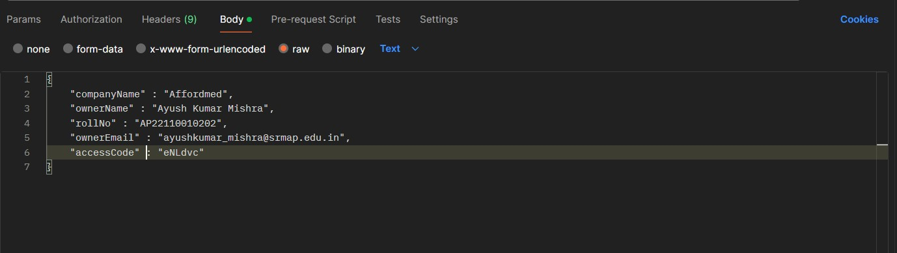
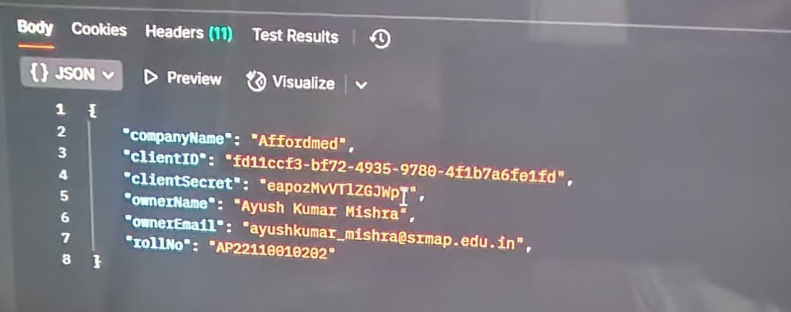
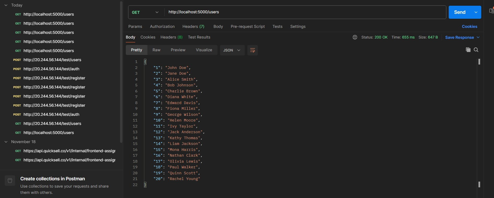

# Social Media Analytics

## 📌 Project Overview
This project is a **Social Media Analytics Dashboard** that allows users to analyze and visualize social media data, including user details and posts. The application follows a **Full Stack Microservices** architecture with:
- **Backend**: Node.js (Express.js)
- **Frontend**: React.js (Next.js with TypeScript)
- **Database**: MongoDB
- **Authentication**: Token-based authentication (JWT)

## 🚀 Features
- User Authentication & Token-based Security
- Fetch and display user details & posts
- Backend API for fetching social media analytics data
- Responsive UI with a dark theme

---

## 📂 Project Structure
```
Affordmed_Assignment/
│── backend/          # Node.js backend (Express.js, APIs)
│── frontend/         # React.js frontend (Next.js, TypeScript)
│── README.md         # Documentation
│── package.json      # Project dependencies
│── .env              # Environment variables
```

---

## 🛠 Installation & Setup

### 🔹 Prerequisites
Make sure you have the following installed:
- **Node.js** (v16 or later)
- **npm** or **yarn**
- **MongoDB** (if using a local database)

### 🔹 Clone the Repository
```sh
git clone https://github.com/your-username/your-repository.git
cd Affordmed_Assignment
```

### 🔹 Backend Setup
```sh
cd backend
npm install   # Install dependencies
cp .env.example .env   # Configure environment variables
node app.js   # Start the backend server
```
The backend will run at: **http://localhost:5000**

### 🔹 Frontend Setup
```sh
cd frontend
npm install   # Install dependencies
npm run dev   # Start the frontend server
```
The frontend will run at: **http://localhost:3000**

---

## 📸 Screenshots
Add images using:
```md



```
Make sure to store the images in a `screenshots/`.

---

## 🔗 API Endpoints
### 🔹 Authentication
- `POST /login` - User Login
- `POST /register` - User Registration

### 🔹 Users
- `GET /users` - Fetch all users

### 🔹 Posts
- `GET /posts` - Fetch all posts

---

## 🤝 Contributing
Feel free to submit issues or pull requests to improve the project!

---

## 📜 License
This project is licensed under the **AYUSH MISHRA**.

